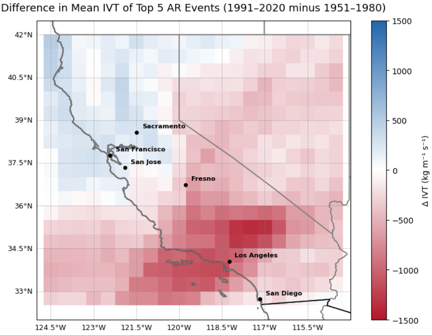

# Analyzing Atmospheric River Data of California, ATM 533 Group Project (Fall 2025, UAlbany, DAES) 



[](https://github.com/ProjectPythia/cookbook-template/actions/workflows/nightly-build.yaml)
[](https://binder.projectpythia.org/v2/gh/ProjectPythia/cookbook-template/main?labpath=notebooks)


This cookbook presents a streamlined workflow for analyzing ERA5-based gridded atmospheric river (AR) data. It begins by demonstrating how to download large climate datasets to a local machine, followed by the extraction of integrated vapor transport (IVT) for AR diagnostics and its interactive visualization. The analysis then identifies some of the most severe AR events during two periods, 1951 to 1980 and 1991 to 2020, and visualizes how the spatial pattern of the most dangerous AR events has changed. The work concludes by comparing how much of the extreme rainfall in Sacramento and Los Angeles can be attributed to ARs across these two periods, while also quantifying changes in key thermodynamic variables, including temperature and precipitation, that are associated with extreme rainfall in California.


## Authors

Team name: DataFrameofMind\
Matthew Sinnenberg [https://github.com/msinnenberg]\
Jesse Hoogs [https://github.com/JesseH44]\
Zuhayr Shahid Ishmam [https://github.com/ishmamshahid]\
Ekaterina Belash [https://github.com/e-belash] 


## Running the Notebooks

You can either run the notebook using [Binder](https://binder.projectpythia.org/) or on your local machine.

### Running on Binder

The simplest way to interact with a Jupyter Notebook is through
[Binder](https://binder.projectpythia.org/), which enables the execution of a
[Jupyter Book](https://jupyterbook.org) in the cloud. The details of how this works are not
important for now. All you need to know is how to launch a Pythia
Cookbooks chapter via Binder. Simply navigate your mouse to
the top right corner of the book chapter you are viewing and click
on the rocket ship icon, (see figure below), and be sure to select
“launch Binder”. After a moment you should be presented with a
notebook that you can interact with. I.e. you’ll be able to execute
and even change the example programs. You’ll see that the code cells
have no output at first, until you execute them by pressing
{kbd}`Shift`\+{kbd}`Enter`. Complete details on how to interact with
a live Jupyter notebook are described in [Getting Started with
Jupyter](https://foundations.projectpythia.org/foundations/getting-started-jupyter).

Note, not all Cookbook chapters are executable. If you do not see
the rocket ship icon, such as on this page, you are not viewing an
executable book chapter.


### Running on Your Own Machine

If you are interested in running this material locally on your computer, you will need to follow this workflow:

(Replace "cookbook-example" with the title of your cookbooks)

1. Clone the `https://github.com/DAES433533/dataframeofmind` repository:

   ```bash
    git clone https://github.com/DAES433533/dataframeofmind.git
   ```

2. Move into the `dataframeofmind` directory
   ```bash
   cd dataframeofmind
   ```
3. Create and activate your conda environment from the `environment.yml` file
   ```bash
   conda env create -f environment.yml
   conda activate dataframeofmind-cookbook-dev
   ```
4. Move into the `notebooks` directory and start up Jupyterlab
   ```bash
   cd notebooks/
   jupyter lab
   ```
